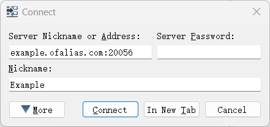

# Teamspeak 语音服务器配置

::: tip 适用场景

- 你已经配置好Teamspeak语音服务器
- 你的服务器 **可以在内网或本地访问**

本指南 **不涉及** Teamspeak语音服务器的搭建教程，您需要先自行搭建好再来阅读本指南
:::

## 确认你的端口和协议

Teamspeak服务默认使用下列端口

|服务            |协议|主机端口|是否必要|
|:--------------:|:-:|:------:|:--:|
|语音服务         |UDP|9987   |是  |
|文件传输         |TCP|30033  |是  |
|服务器查询（raw）|TCP|10011  |可选|
|服务器查询（SSH）|TCP|10022  |可选|
|网络查询（http） |TCP|10080  |可选|
|网络查询（https）|TCP|10443  |可选|
|TSDNS           |TCP|41144  |可选|

>若您的Teamspeak服务与OpenFRP实例不在同一环境下，请不要忘记 **放行防火墙端口**

- 穿透Teamspeak服务时，**本地端口** 与 **远程端口** 需要相同
- 如果穿透节点的对应端口被占用，请见[修改Teamspeak服务端端口](#修改端口)

## 修改端口

:::tip 什么情况下需要修改端口？

- **穿透节点** 的对应端口被占用
- 你的其他服务占用了 **本地端口**  

进行下列操作前，请确保你安装了SSH客户端
:::

确认你的Teamspeak服务器 **正在运行**  
打开终端，通过SSH登录Teamspeak服务器控制台

```bash
ssh -p 10022 serveradmin@127.0.0.1
# 10022 为Teamspeak SSH控制台端口
# serveradmin 为Teamspeak SSH控制台管理员用户
# 127.0.0.1 为Teamspeak服务器实例的IP地址
```

如下，输入管理员密码
>如果您不记得您的管理员密码，请在Teamspeak服务端的日志文件中查找

```bash
serveradmin@127.0.0.1's password:
```

如果密码输入正确，终端应如下显示

```bash
TS3
Welcome to the TeamSpeak 3 ServerQuery interface, type "help" for a list of commands and "help <command>" for information on a specific command.
serveradmin>
```

输入下列命令，修改端口

```bash
serverstop sid=1
use sid=1 -virtual
serveredit virtualserver_port= #你想要更改的语音服务端口
serveredit filetransfer_port= #你想要更改的文件传输端口
use sid=0
serverstart sid=1
```

输入过程中，若提示

```bash
error id=0 msg=ok
```

说明命令执行成功  
提示 **其他内容** 说明命令执行失败

## 创建隧道

### TCP隧道

打开[OpenFrp控制面板](https://console.openfrp.net/create-proxies)，选择侧边栏的 **创建隧道** 选项。


选择任意节点，在左上角的隧道类型选择 `TCP`  
如图所示，填入Teamspeak实例的 **IP地址** 和对应服务的 **端口**

- 请注意，**本地端口** 与 **远程端口** 需要相同
- 文件查询端口 `30033` 是必须的


信息填写完成后点击 **提交**，若提示 **创建成功** 并自动跳转到 **管理隧道** 页面，则隧道创建成功

### UDP隧道

打开[OpenFrp控制面板](https://console.openfrp.net/create-proxies)，选择侧边栏的 **创建隧道** 选项。


选择带有 `√ UDP` 标识的节点，在左上角的隧道类型选择 `UDP`  
如图所示，填入Teamspeak实例的 **IP地址** 和对应服务的 **端口**

- 请注意，**本地端口** 与 **远程端口** 需要相同
- 语音服务端口 `9987` 是必须的


信息填写完成后点击 **提交**，若提示 **创建成功** 并自动跳转到 **管理隧道** 页面，则隧道创建成功

## 连接到Teamspeak服务器

在 **管理隧道** 页面中，找到你新创建的 **语音服务** 隧道，点击最右侧的 **操作** 按钮，选择 **详情**


此处可以查看你的 **节点地址** 和 **远程端口**  
如下图所示，**节点地址** 是 `example.ofalias.com`，**远程端口** 是 `20056`
>你也可以在 **启动器日志** 中查看你的 **节点地址** 和 **远程端口**  


打开Teamspeak客户端  
点击左上角的 **Connections** 按钮


输入 **节点地址**:**远程端口** 和 **服务器密码**（如果有）加入服务器  
例如 `example.ofalias.com:20056`



至此，恭喜你完成了所有配置👍
