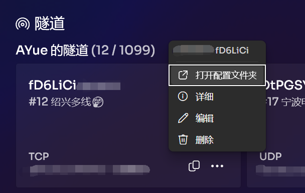
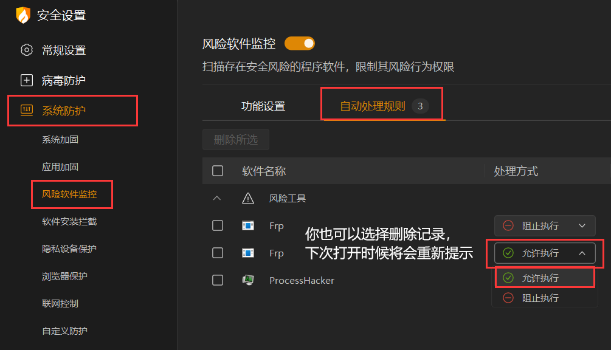
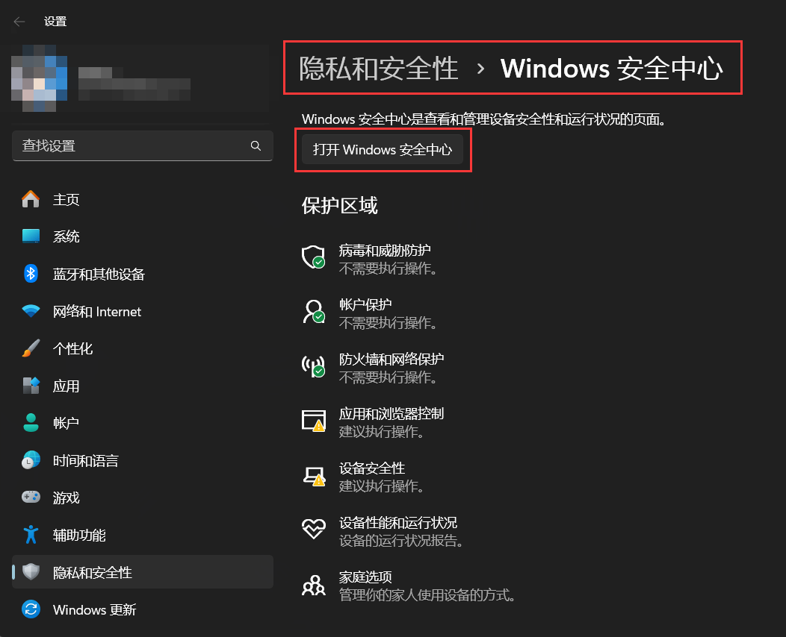
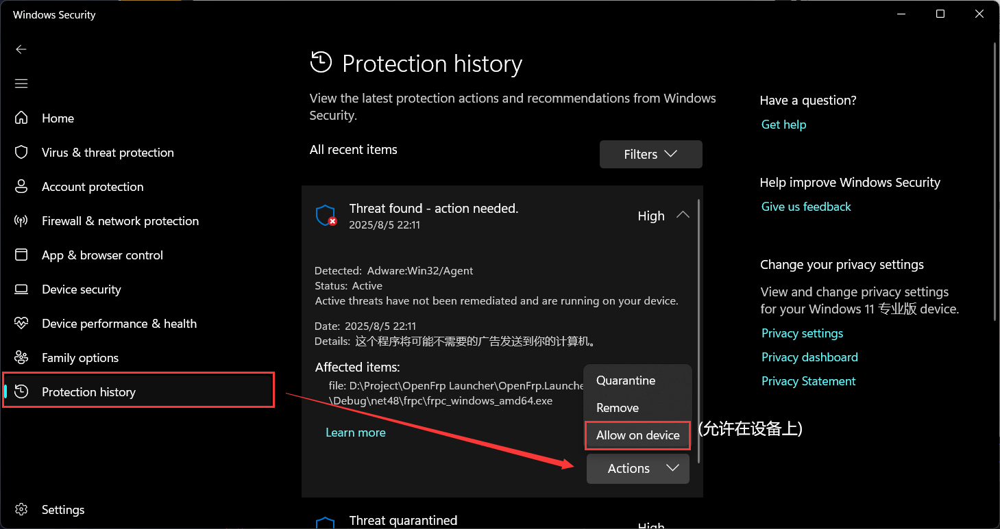
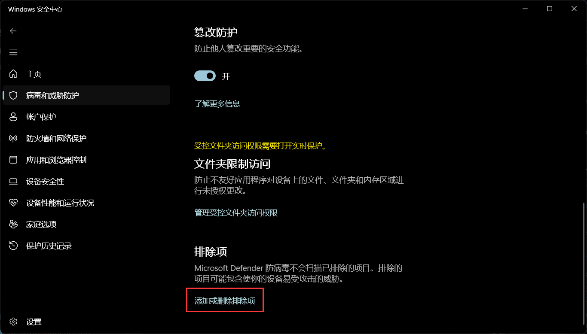

# Windows WPF 桌面启动器

如果您来到这里了,您可能是刚刚使用，因为很简单，压根不需要怎么看就会的。

因为已整合网页版的登录，您不需要自备 UserToken, 直接进行登录操作即可 

## 如何进行 FRPC 配置（例如证书）



## Windows 7 无法正常打开

首先，您需要保证您的系统为 Windows 7 SP1,然后接着下一步。


由于国内系统精简过度 / 不喜欢更新，导致
`Microsoft Root Certificate Authority 2011`
缺失，这会导致您无法直接安装`.Net Framework`

您需要在互联网上找到该证书，然后安装。（过程略）

接着，您便可以直接安装 .NET Framework (版本 4.8，且最好使用离线安装包)

## 我是 Windows 10，但是也无法打开也无法卸载

如图所示（可能内容不同）


请保证您的系统内安装了 .NET Framework 4.8 或者 .NET 9 Runtime（在您安装 Net9 编译版本时，后者是需要的）

## FRPC 功能异常


若您使用了 Windows Defender （不是防火墙），请参见下方 [加入系统白名单](#加入系统白名单)

若您使用了火绒，且第一次使用时在**风险弹窗**点击了拒绝，请参见下图：

## 加入系统白名单

如果您信任我们，可以把对应文件夹 / 文件 加入杀软白名单；如果您更信任杀软，您可以卸载我们的启动器并更换为上游官版 FRPC。

如果您使用的是 Windows Defender ，请按照以下步骤进行：



打开 Windows Defender 后，您有以下两个选项，其中方法 2 较为稳靠，在更新时不会触发规则。

### 方法1：在拦截时到 "保护历史" 中找到相关记录，允许。


### 方法2: 添加文件夹白名单




进入后，点击 "添加排除项" - "文件夹"


对于图片三，建议将上级文件夹(即 OpenFrpLauncher 文件夹)
加入系统白名单。

如果您是懒人用户,请直接安装其他杀软屏蔽系统自带杀软即可(如火绒)。

## 其他常见问题

### System.TypeLoadException: 程序集“PresentationCore”中的类型“MS.Internal.Automation.SelectionProviderWrapper”的方法“GetSelection”没有实现。

这是由于一个 Windows 更新包的问题，参见如下：

在Windows更新管理界⾯中，找到“卸载更新”

Windows 10：[官⽅⽂档](https://support.microsoft.com/zh-cn/windows/%E5%A6%82%E4%BD%95%E5%8D%B8%E8%BD%BD-windows-%E6%9B%B4%E6%96%B0-c77b8f9b-e4dc-4e9f-a803-fdec12e59fb0#ID0EBF=Windows_10)
1. 选择“开始”按钮，然后选择“设置 >更新&
安全 > Windows 更新> 查看更新历史记
录 >卸载更新。
也可以使⽤命令：(<a href="ms-settings:windowsu
pdate-history?activationSource=SMC-A
rticle-12415">打开</a>)

```
ms-settings:windowsu
pdate-history?activationSource=SMC-A
rticle-12415
```

2. 选择并按住 (或右键单击要删除的更新) ，
然后选择“卸载”。

Windows11：
1. 选择“开始” > “设置” > “Windows 更新”
 “更新历史记录” > “卸载更新”。<br/>
 <br/>
也可以使⽤命令：(<a href="ms-settings:windowsu
pdate-history?activationSource=SMC-A
rticle-12415">打开</a>)
```
ms-settings:windowsu
pdate-history?activationSource=SMC-A
rticle-12415
```
2. 在显示的列表中，找到要删除的更新，然后
选择“卸载”

附加：要卸载的更新:
1. KB5011050
2. KB5028947
3. KB5011048

::: tip
若您下载的为 .NET Framework 4.8.1 版本的启动器，请切换为 .NET Framework 4.6.2 版本的启动器。

在此之后请勿安装 .NET Framework 4.8.1，否则问题将会再次出现。
::: tip

### System.Configuration.ConfigurationErrorsException: 配置文件已被另一个程序更改。

一般不会出现这个情况，若真的出现了，请按照以下步骤：

按下 Windows + R
(Windows 键就是键盘上那颗徽标)
输入:
```bash
cmd /c rmdir /s /q %appdata%/../Local/OpenFrp.Launcher
```

### System.Runtime.InteropServices.COMException: {已禁用桌面合成} 操作无法完成，因为已禁用桌面合成

检查你是否在使用 Microsoft RDP 服务...

如果是这样的话，建议切换使用 Net9 编译版启动器

### 找不到 FRPC 文件

请参见 [加入系统白名单](#加入系统白名单)

### Another... | 其他....

请先更新启动器到最新版本后再反馈......另外，你们为什么不喜欢更新启动器啊。
