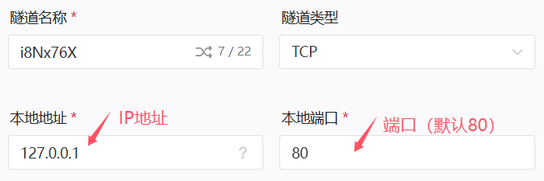
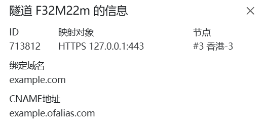

# Web应用（HTTP/HTTPS）配置

:::tip 适用场景

- 穿透WordPress等个人网站
- 穿透MCSManager面板、宝塔面板等自建应用

本指南 **不涉及** 任何应用的搭建教程，您需要先自行搭建好网站再来阅读本指南
:::

## 查看你的本地IP、端口和协议

使用 **浏览器** 在 **内网** 访问你的服务。访问时 **地址栏** 内的网址一般是这样的:

```http
无自定义端口：
http://<本地 IP>/ 

有自定义端口：
http://<本地 IP>:<本地端口>/
```

如果你的服务自带 `HTTPS` 或 `TLS`：

```http
无自定义端口：
https://<本地 IP>/ 

有自定义端口：
https://<本地 IP>:<本地端口>/
```

可以把这行网址分为 **四部分**：

|http://|192.168.31.112|:4000|/index.html|
|-----|-----|-----|-----|
|访问协议|IP地址|端口号|路径|

:::tip 为什么我的网址没有端口号？

- 默认 `HTTP` 端口号为 `80`，访问 `http://example.com` 时，实际访问 `http://example.com:80`
- 默认 `HTTPS` 端口号为 `443`，访问 `https://example.com` 时，实际访问 `https://example.com:443`
:::

## 确定你的隧道类型

|隧道类型|默认端口|访问方式|绑定域名|
|:-------:|:--------:|:----:|:---:|
|[HTTP](#http-https隧道) |`80`                   |`http://example.com`      |**必须**|
|[HTTPS](#http-https隧道)|`443`                  |`https://example.com`     |**必须**|
|[TCP](#tcp隧道)         |自定义（除`80`,`443`外）|`https://example.com:端口`|可选    |

>若您的Web实例与OpenFRP实例不在同一环境下，请不要忘记 **放行防火墙端口**

- 使用**中国大陆**节点创建`TCP`隧道需要**实名认证**
- 使用**中国大陆**节点创建`HTTP`和`HTTPS`隧道需要**实名认证**，且您的域名需要在**工信部备案**
- 已通过**工信部备案**的域名需要在[用户中心](https://openid.17a.ink/dashboard)添加**备案域名**后才能创建隧道
- 没有自己的域名？[获取Natayark免费域名](/use/other/free-domain.html#获取域名)

## 创建隧道

### HTTP/HTTPS隧道

打开[OpenFrp控制面板](https://console.openfrp.net/create-proxies)，选择侧边栏的 **创建隧道** 选项。


选择带有 `√ HTTP(S)` 或 `√ HTTPS` 标识的节点，在左上角的隧道类型选择 `HTTP` 或 `HTTPS`  
如下图所示，填入你在第一步获取的 **IP地址** 和 **端口**，`域名` 填写你准备绑定的域名


:::tip
`√ HTTP(S)` 节点可以创建HTTP隧道和HTTPS隧道，`√ HTTPS` 节点仅能创建HTTPS隧道  
如果您的网站没有HTTPS，但您需要在外网通过HTTPS访问，请见[自动HTTPS配置](#自动https配置)
:::

信息填写完成后点击 **提交**，若提示 **创建成功** 并自动跳转到 **管理隧道** 页面，则隧道创建成功

### TCP隧道

打开[OpenFrp控制面板](https://console.openfrp.net/create-proxies)，选择侧边栏的 **创建隧道** 选项。


选择任意节点，在左上角的隧道类型选择 `TCP`  
如图所示，填入你在第一步获取的 **IP地址** 和 **端口**



信息填写完成后点击 **提交**，若提示 **创建成功** 并自动跳转到 **管理隧道** 页面，则隧道创建成功

## 设置解析

:::tip 什么情况下需要设置解析？

- `HTTP` 和 `HTTPS` 类型的隧道 **必须** 设置解析
- `TCP` 类型的隧道可以设置解析，也可以使用节点域名或节点IP **带端口** 访问
:::

在 **管理隧道** 页面中，找到你新创建的隧道，点击最右侧的 **操作** 按钮，选择 **详情**


此处可以查看你的 **绑定域名** 和 **节点地址**
如下图所示，**节点地址** 是 `example.ofalias.com`，**绑定域名** 是 `example.com`



:::tip 绑定域名和您设置解析的域名需完全一致

- **记录类型** 选择 `CNAME`
- **记录值** 填写 **节点地址**
- **主机记录** 按你的 **域名前缀** 填写
:::
| 主机记录     | 域名前缀 | 实际网址         |
| :-------------:|:-------:| :-------------: |
 @               |    无    | `example.com`    |
| www           |   www   | `www.example.com`|
| abcd           |   abcd   | `abcd.example.com`|

确认好你要设置的 **记录类型**、**记录值**、**主机记录** 和 **域名** 后，请到 **域名注册商控制台** 设置解析记录  
下方列出了部分域名注册商设置解析的方式，如果不会操作，可以咨询 **域名注册商客服**  

- [阿里云](https://help.aliyun.com/zh/dns/add-a-dns-record#h2-cname-2)
- [腾讯云](https://cloud.tencent.com/document/product/302/3450)
- [Natayark免费域名](/use/other/free-domain.html#cname记录)

至此，恭喜你完成了所有配置👍
