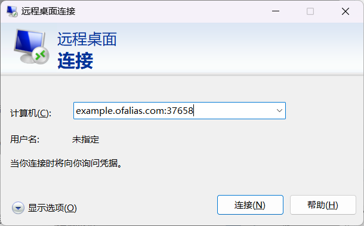

# RDP远程桌面配置

:::danger 安全警告
穿透远程桌面前 **必须** 确保您的系统已经 **安装了最新的补丁** 并且设置了 **强登录密码**  
进行内网穿透等于 **绕过所有防火墙** 将您的计算机直接暴露于公网中，您需要自行承担由此带来的风险
:::

## 启用远程桌面服务

如果您还没有启用远程桌面的话，请先 [点击这里](ms-settings:remotedesktop) 打开设置，打开 **启用远程桌面** 开关。

## 确认服务主机

请先确认 **开启隧道的主机** 和 **启用远程桌面的主机** 是不是同一台

### 是同一台主机

- **本地地址** 为 `127.0.0.1`
- **本地端口** 为 `3389`

### 不是同一台主机

使用 **远程桌面连接** 访问 **启用远程桌面的主机** ，确认能 **成功连接** 后，如图所示

- **本地地址** 为 `192.168.1.4`
- **本地端口** 为 `3389`

>如果没有显示端口，则端口为默认端口`3389`

## 确定你的隧道类型

|隧道类型| 默认端口| 远程端口| 访问方式|
|:-----:|:--------:|:----------:|:-------:|
|[(必选) TCP](#tcp隧道)| 3389| 自定义| **系统自带远程桌面连接** 或 **RD Client(移动端)**|
|[(可选) UDP](#udp隧道-可选)| 3389 |与TCP端口相同|用于优化连接|

>若您的RDP主机与OpenFRP实例不在同一环境下，请不要忘记 **放行防火墙端口**

## 创建隧道

### TCP隧道

打开[OpenFrp控制面板](https://console.openfrp.net/create-proxies)，选择侧边栏的**创建隧道**选项。

选择任意节点，在左上角的隧道类型选择`TCP`  
如图所示，填入你获取的`IP地址`和`端口`

信息填写完成后点击**提交**，若提示**创建成功**并自动跳转到**管理隧道**页面，则隧道创建成功

### UDP隧道(可选)

打开[OpenFrp控制面板](https://console.openfrp.net/create-proxies)，选择侧边栏的**创建隧道**选项。

选择带有 `√ UDP` 标识的节点，在左上角的隧道类型选择`UDP`  
如图所示，填入你获取的`IP地址`和`端口(与TCP隧道相同)`

信息填写完成后点击**提交**，若提示**创建成功**并自动跳转到**管理隧道**页面，则隧道创建成功

## 连接到RDP远程桌面

在 **管理隧道** 页面中，找到你新创建的 `TCP` 隧道，点击最右侧的 **操作** 按钮，选择 **详情**

此处可以查看你的 **节点地址** 和 **远程端口**  
如下图所示，**节点地址** 是 `example.ofalias.com`，**远程端口** 是 `37658`
>你也可以在 **启动器日志** 中查看你的 **节点地址** 和 **远程端口**  

打开 **远程桌面连接**  
在 **计算机** 一栏输入 **节点地址**:**远程端口** 连接  
例如 `example.ofalias.com:37658`

至此，恭喜你完成了所有配置👍
