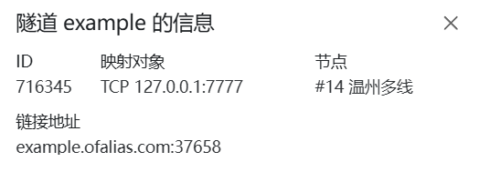
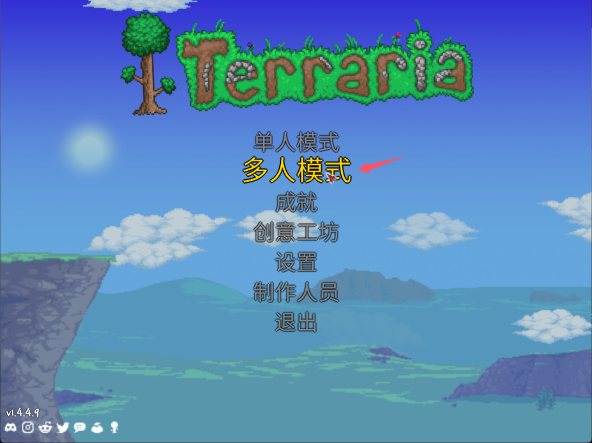
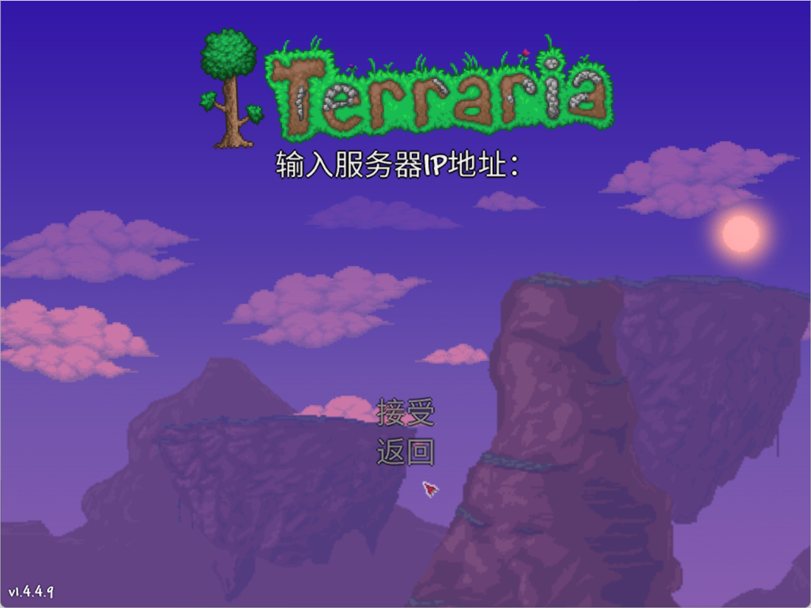

# 泰拉瑞亚（Terraria）服务端配置

::: tip 适用场景

- 你已经配置好Terraria服务端
- 你的服务端 **可以在内网或本地访问**

本指南 **不涉及** Terraria服务端的搭建教程，您需要先自行搭建好再来阅读本指南
:::

## 确认你的端口

Terraria服务端的 **默认端口** 一般为 `7777`  

- 在客户端内选择 **开服并开始游戏** 同样使用 `7777` 端口

若您不确认是否为该端口，可打开Terraria服务端配置文件，在其中找到 `-port` 配置项

```bash
-port <port number>                  指定要侦听的端口。
```

如果您找不到服务端配置文件，则使用 **默认端口** 即可

## 确定你的隧道类型

|隧道类型| 默认端口| 远程端口|
|:-------------:|:---:|:-----:|
|[TCP](#tcp隧道)|`7777` | 自定义（不建议与默认端口相同）|

>若您的Terraria服务端与OpenFRP实例不在同一环境下，请不要忘记 **放行防火墙端口**

## 创建隧道

### TCP隧道

打开[OpenFrp控制面板](https://console.openfrp.net/create-proxies)，选择侧边栏的 **创建隧道** 选项。


选择任意节点，在左上角的隧道类型选择 `TCP`  
如图所示，填入Terraria服务端的 **IP地址** 和 **端口**


信息填写完成后点击 **提交**，若提示 **创建成功** 并自动跳转到 **管理隧道** 页面，则隧道创建成功

## 连接到服务器

在 **管理隧道** 页面中，找到你新创建的隧道，点击最右侧的 **操作** 按钮，选择 **详情**


此处可以查看你的 **节点地址** 和 **远程端口**  
如下图所示，**节点地址** 是 `example.ofalias.com`，**远程端口** 是 `37658`
>你也可以在 **启动器日志** 中查看你的 **节点地址** 和 **远程端口**  



打开Terraria客户端，选择 **多人模式**



选择角色，输入 **节点地址**:**远程端口** 加入服务器  
例如 `example.ofalias.com:37658`



至此，恭喜你完成了所有配置👍
